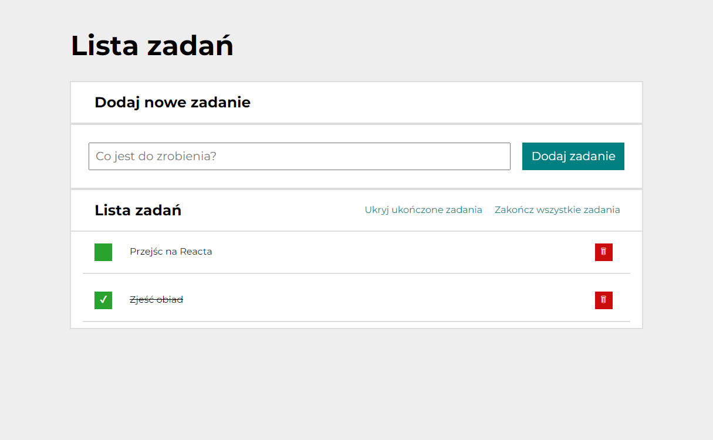
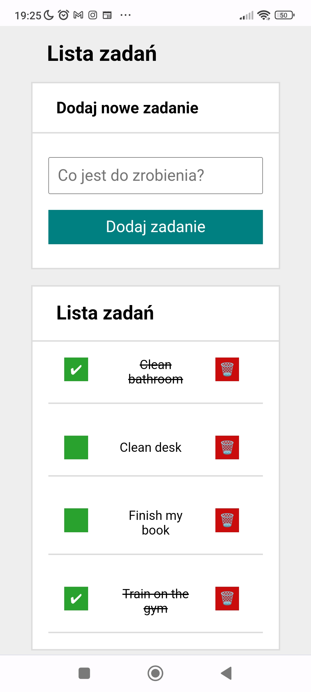

# Todo List in React

## Repo: [https://github.com/Mr-SuSeL/todos-list-react/](https://github.com/Mr-SuSeL/todos-list-react/)

## Demo: [https://mr-susel.github.io/todos-list-react/](https://mr-susel.github.io/todos-list-react/)

## Description

That usefull little app can help you with note all of your tasks to do in this particular short period of time.
You can edit tasks, sign it as checked or just delete and create new one.
CSS media querry helps view that app in clear estethic way also on mobile phone screen.

### Page features

- ECMAScript +06 features
- Flexbox and Grid modules
- Styled-Components
- Simple design - clean code
- Source code based on function structure
- Media querry (RWD)
- React 18 framework/library with hooks
- Module based architecture
- Redux Toolkit for global state management
- Redux - Saga
- React Router

This project uses [Redux Toolkit](https://redux-toolkit.js.org/) to manage global state efficiently. Redux enables predictable state updates by dispatching actions and handling state immutably. In this app, tasks and UI state (like hiding done tasks) are managed with Redux slices, making the app scalable and maintainable.

This project was bootstrapped with [Create React App](https://github.com/facebook/create-react-app).

## App screenshot

Responsive design - view from mobile phone:  

## Available Scripts

In the project directory, you can run:

### `npm start`

Runs the app in the development mode.  
Open [http://localhost:3000](http://localhost:3000) to view it in your browser.

The page will reload when you make changes.  
You may also see any lint errors in the console.

### `npm run build`

Builds the app for production to the `build` folder.  
It correctly bundles React in production mode and optimizes the build for the best performance.

The build is minified and the filenames include the hashes.  
Your app is ready to be deployed!

See the section about [deployment](https://facebook.github.io/create-react-app/docs/deployment) for more information.

### `npm run eject`

**Note: this is a one-way operation. Once you `eject`, you can't go back!**

If you aren't satisfied with the build tool and configuration choices, you can `eject` at any time. This command will remove the single build dependency from your project.

Instead, it will copy all the configuration files and the transitive dependencies (webpack, Babel, ESLint, etc) right into your project so you have full control over them. All of the commands except `eject` will still work, but they will point to the copied scripts so you can tweak them. At this point you're on your own.

You don't have to ever use `eject`. The curated feature set is suitable for small and middle deployments, and you shouldn't feel obligated to use this feature. However we understand that this tool wouldn't be useful if you couldn't customize it when you are ready for it.
